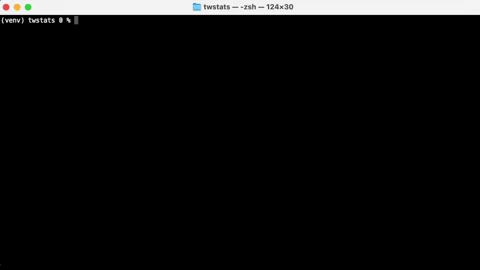

# About

Python command line program for downloading tribalwars world stats.

For example, stats of the latest [.net worlds](https://en.tribalwars.net/page/stats):



**Usage Extract**

```
usage: fetchstats.py [-h] [-c, --column-names] url|file [url|file ...]

Fetch stats of all active worlds from https://[tribalwars_domain]/page/stats and write to stdout in csv format. 
Log messages and errors are written to stderr.

positional arguments:
  url|file            tribalwars server URL or file containing one URL per line. Example URL: https://staemme.ch

optional arguments:
  -h, --help          show this help message and exit
  -c, --column-names  first line written to stdout is the name of columns

```

# Example

The following example will download stats of current [.net](https://en.tribalwars.net/page/stats) worlds while 
redirecting the data (stdout) to `stats.csv` (logs are written to stderr and therefore still appear in the terminal):
```
$ python3 fetchstats.py -c https://en.tribalwars.net >> stats.csv
fetched stats for https://en117.tribalwars.net/en-dk/page/stats
fetched stats for https://en120.tribalwars.net/en-dk/page/stats
fetched stats for https://enc2.tribalwars.net/en-dk/page/stats
fetched stats for https://enp9.tribalwars.net/en-dk/page/stats
fetched stats for https://enc4.tribalwars.net/en-dk/page/stats
fetched stats for https://en112.tribalwars.net/en-dk/page/stats
fetched stats for https://en116.tribalwars.net/en-dk/page/stats
fetched stats for https://enp10.tribalwars.net/en-dk/page/stats
fetched stats for https://en118.tribalwars.net/en-dk/page/stats
fetched stats for https://enp8.tribalwars.net/en-dk/page/stats
fetched stats for https://enc1.tribalwars.net/en-dk/page/stats
fetched stats for https://en115.tribalwars.net/en-dk/page/stats
fetched stats for https://en119.tribalwars.net/en-dk/page/stats
fetched stats for https://en114.tribalwars.net/en-dk/page/stats
fetched stats for https://enp11.tribalwars.net/en-dk/page/stats
```

Content of `stats.csv` afterwards:
```
world,fetch_timestamp,n_players,total_villages,player_villages,barb_villages,bonus_villages,server_runtime,players_online,messages_sent,forum_posts,troop_movements,trade_movements,n_tribes,n_players_in_tribes,total_points,total_wood,total_clay,total_iron,spear,sword,axe,archer,scout,light,marcher,heavy,ram,cat,knight,noble,aggregated_at
en117,1622993608,1000,49179,49046,133,5429,207,55,113031,62121,61293,21338,219,760,476079008,8178809658,7525060696,9702053804,126435000000,75346000000,99416000000,53976000000,10307000000,46893000000,1439000000,23822000000,5897000000,4607000000,2352,8558,16:19
en120,1622993608,9902,22836,12080,10749,2709,26,819,67146,28986,159674,4695,504,4411,18938111,101262046,102831615,108327947,4999000000,3005000000,3123000000,634949,968578,1494000000,42647,166420,170008,52071,4758,1059,16:26
enc2,1622993608,1063,8379,3091,5288,479,73,22,5936,2725,16404,588,88,290,18780233,237952615,242242610,220329567,5209000000,3481000000,4867000000,0,455356,2219000000,0,719893,243725,135654,543,283,16:24
enp9,1622993609,814,27055,27040,15,316,368,29,36934,35004,1064,5708,100,662,254145545,4394824663,4138542889,4921797840,73967000000,52838000000,59615000000,28560000000,8535000000,23923000000,2015000000,15880000000,2823000000,1507000000,2706,18868,16:30
enc4,1622993609,130,16919,14268,2651,0,180,3,18174,10233,336,585,67,117,155835995,2587313165,1650912903,3180360296,39743000000,30233000000,35267000000,0,2791000000,19291000000,0,6386000000,1830000000,1741000000,0,1227,16:02
en112,1622993609,167,35057,34934,123,1168,508,12,90958,34265,26172,12517,47,156,358099178,6185925568,4088164891,8489659618,123151000000,88630000000,86212000000,0,7274000000,40445000000,0,24136000000,5797000000,3784000000,479,6745,15:41
en116,1622993610,445,37186,37082,104,2862,270,17,34450,36840,7160,4856,105,374,398586513,8829120158,5220318866,8060832036,88992000000,71050000000,113245000000,0,4613000000,55870000000,0,10950000000,6927000000,3333000000,1091,11547,16:16
enp10,1622993610,1557,22412,22331,81,215,207,52,23784,17140,2492,4470,124,949,171176596,2729054756,2563531620,3202889125,46971000000,34095000000,35996000000,18958000000,5795000000,14627000000,1037000000,8755000000,1621000000,941532,3602,9252,15:39
en118,1622993610,1938,40795,39685,1110,3166,144,111,84283,49115,57742,7864,333,1151,356138450,6056165137,5829169100,7271345792,106724000000,68674000000,71168000000,51881000000,7639000000,31534000000,1611000000,18499000000,3894000000,3413000000,3443,8006,15:49
enp8,1622993610,389,25877,25574,303,292,536,17,44492,52363,4977,6995,62,364,240673732,4686318952,4545667513,4946882418,68060000000,40772000000,60856000000,40360000000,6899000000,23880000000,3073000000,16800000000,2851000000,1577000000,1784,23723,15:53
enc1,1622993611,115,0,0,0,0,0,5,0,1,0,0,5,9,0,0,0,0,0,0,0,0,0,0,0,0,0,0,0,0,16:03
en115,1622993611,326,29761,29626,135,1325,326,7,25644,24036,2774,8386,92,282,309742401,7009078094,4588522038,6333391896,75477000000,37465000000,88925000000,0,4725000000,43283000000,0,13930000000,4595000000,3755000000,0,7790,16:26
en119,1622993611,3633,32114,25229,6882,2150,88,241,82750,52288,71334,8907,505,2200,164769995,2510933313,2344148512,2504416907,61325000000,34687000000,34567000000,0,5020000000,14592000000,0,8428000000,1926000000,1074000000,0,4917,16:07
en114,1622993611,283,37997,37972,25,1894,390,16,61085,27113,13686,12067,75,255,396911960,6334642595,4283373304,8180821076,114117000000,64029000000,81485000000,42221000000,7047000000,37348000000,2055000000,24144000000,5089000000,3398000000,945,4900,15:55
enp11,1622993612,474,2224,678,1546,33,23,59,541,361,7920,207,25,216,1478543,15513369,15895395,19896250,147312,50067,242045,5398,30412,145491,1396,2907,5813,1484,350,67,16:07
```

Writing log messages to `log.txt` and showing csv data in the terminal:
```
$ python3 fetchstats.py -c https://en.tribalwars.net 2> log.txt
```

On Linux/MacOS, you can display formatted csv using the `colum` program (assuming `stats.csv` in your working directory):

```
column -s, -t < stats.csv | less -#2 -N -S
```

# Cronjob

Tribalwars updates world stats every ~1 hour, if you want to fetch stats periodically, you could configure a [cronjob](https://linuxhandbook.com/crontab/).

Cronjob for executing the script every full hour:
```
0 * * * * python3 /path/to/fetchstats.py https://en.tribalwars.net >> /path/to/stats.csv 2>>/path/to/log.txt
```

There are [websites](https://crontab.guru) which help finding the desired cron periodicity.

I have created a `Dockerfile` and `docker-compose.yml` to deploy a docker container which executes the script 
every full hour and appends data to `data/twstats.csv` and logs to `data/twstats.log`.

You can list the tribalwars servers to fetch stats from in `servers.txt` (one per line).

Start the docker container in background:
```
$ docker-compose up -d
```

In order to change cron periodicity (for example once every day at midnight `0 0 * * *`), have a look at the `Dockerfile`.
After modifying the `Dockerfile`, run `docker-compose up -d --build` to trigger a rebuild of the image.
